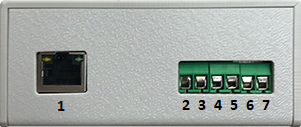

# iotechCONTROL

Repositório para informações, atualizações e discussões sobre o dispositivo iotechControl.

## Apresentação

O dispositivo iotechCONTROL é o dipositivo capaz de monitorar equipamentos e acionar equipamentos através do seu celular e (em breve) do portal do cliente.

Ele possui 2 entradas de sinais digitais e uma saída de sinal digital, através das quais o usuário poderá conectar qualquer equipamento que possua sinais de estados e comando de acionamento digitais. As suas principais formas de uso (não se restringindo somente a elas) são no monitoramento de centrais de alarme, cercas eletrificadas, portões eletrônicos, fechaduras elétricas e bombas d'água.

## O Dispositivo

O iotechControl é um dispositivo de comunicação em rede por fio através de protocolo de comunicação TCP-IP sobre criptografia própria e autenticação de usuário, na arquitetura de cliente-servidor.

O dispositivo possui 7 portas físicas, conforme figura 1:

- Porta 1: entrada RJ-45 (conexão Ethernet)
- Porta 2: pólo negativo (-)
- Porta 3: pólo positivo (+)
- Porta 4: entrada digital
- Porta 5: entrada digital
- Porta 6: saída digital
- Porta 7: sem uso

## Como funciona

O dispositivo possui atualmente _firmwares_ em produção que monitoram 2 sinais digitais de estados e enviam 1 comando digital. A interpretação dos estados e comandos são feitos em nossos servidores, através de conexão autenticada e comunicação criptografada. Cada dispositivo possui um código de identificação único e é através dele que o usuário adiciona à sua lista de dispositivos no app da iotech.

## Exemplos de uso

Para o uso comum, seu equipamento deve possuir acesso a portas que possam transmitir os estados principais de operação e permitir acionamento.

To be continued...

